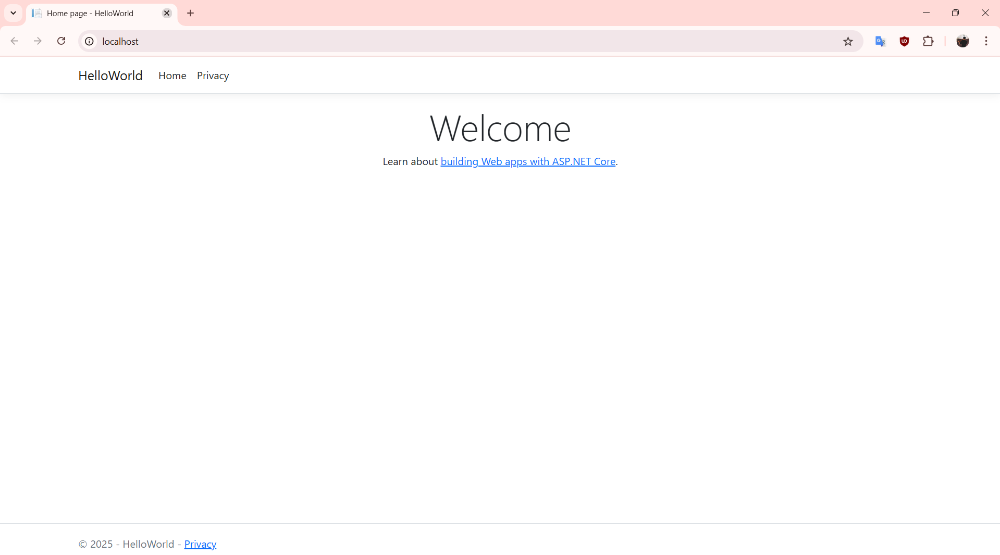
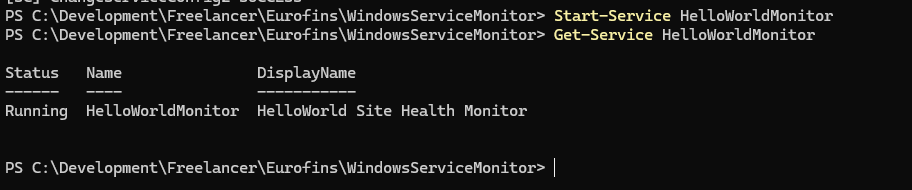

# High Level Overview
Required:
1. .NET Core Web App (Hello World)
2. CI pipeline (build + zip)
3. IIS deployment script
4. Windows Service to monitor the IIS app
5. Windows Service deployment script

Optional:
6. Docker Image
7. Docker Deployment Script

# Check List
## Step 1: Build (Done)
+ Create a `.NET Core 3.1+` web app (HelloWorld).
+ Push it to a Git repository (GitHub).
+ Set up a CI pipeline (GitHub Actions)
    - Trigger on push/commit to `main`/`master`
    - Restore + build the solution
    - Package the app into a `.zip`
+ Follow best practices:
    - Clear project structure
    - `.gitignore` included
    - Meaningful commit messages
    - Code formatting (Prettier)

## Step 2: IIS Deployment Script
Using PowerShell:
+ Create a script to:
    - Add a local group (if not exists) and user to the group
    - Create a new IIS website (`New-Website`)
    - Bind HTTPS with a self-signed cert (or explain if skipped)
    - Set log path (`Set-ItemProperty`)
    - Create and assign application pool to a sub-application
+ Ensure `HelloWorld` is accessible via `http://localhost`

If IIS isn't installed
```powershell
# Run as Administrator
Enable-WindowsOptionalFeature -Online -FeatureName IIS-WebServerRole -All
Install-WindowsFeature Web-App-Dev, Web-Http-Redirect, Web-Asp-Net45, Web-Net-Ext45
```


## Step 3: Log Status Windows Service
In C#:
+ Create a Windows Service app that:
    - Run every 60 seconds
    - Sends a request to `http://localhost/...`
    - Logs HTTP status and message to a log file
    - Stops the service if HTTP status != 200
Structure
```plaintext
WindowsServiceMonitor/
├── Program.cs
├── Service.cs
├── WindowsServiceMonitor.csproj
```

## Step 4: Windows Service Deployment Script
Using PowerShell:
+ Script to:
    - Install the service (`sc create` or `New-Service`)
    - Assign to specific user
    - Set startup type to `Auto`
    - Configure error recovery: restart after 300 seconds


## Step 5: Docker Image (Optional)
+ Add Dockerfile for `HelloWorld`
+ Modify CI pipeline to:
    - Build Docker Image
    - Tag and push to Docker Hub or local registry

## Step 6: Docker Deployment (Optional)
+ Write a script to:
    - Pull or use local Docker Image
    - Run the container with port mapping
    - Explain if any parts are simulated due to time/env

📦 Final Deliverables
+ HelloWorld/ (.NET web app, with solution and project files)
+ WindowsServiceMonitor/ (service source)
+ .github/workflows/ci.yml
+ iis_deploy.ps1 and install_service.ps1 (scripts)
+ Dockerfile (optional)
+ README.md with:
    - How to run everything
    - Screenshots (if helpful)
    - Any assumptions or decisions
+ Zip entire folder and email it back
